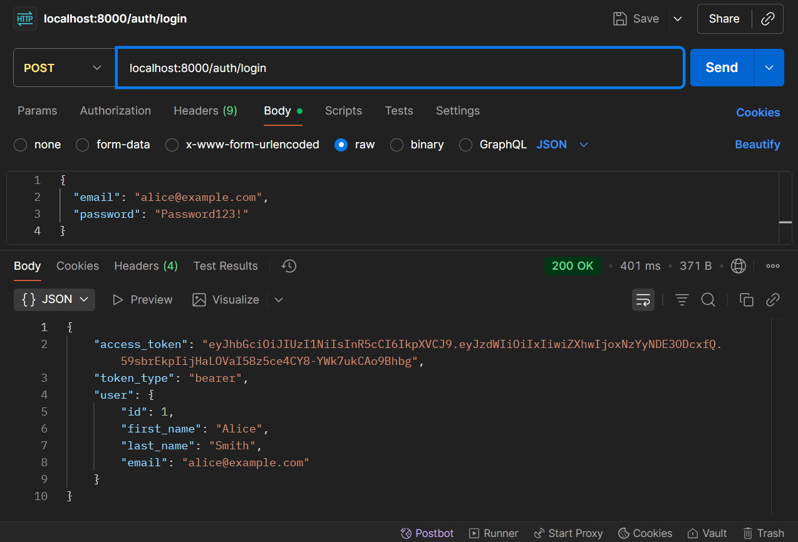
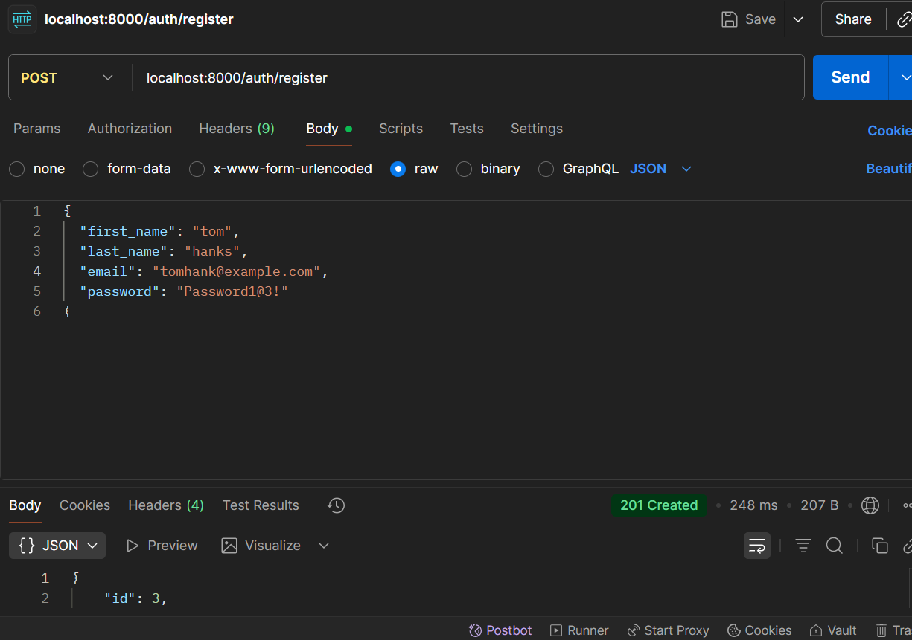
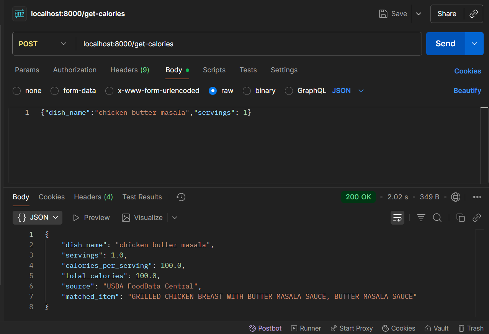

# Meal Calorie Backend (FastAPI)

- The app will  automatically create database tables on startup.
- Logging is configured (file and console); logs go to `logs/app.log`.
- If `SECRET_KEY` is not set to a secure value, the app will generate a secure runtime key and log a warning. **For production, set SECRET_KEY in .env.**

- The USDA parsing is hardened to better detect calories per serving vs per 100g using `foodPortions`, `servingSize`, `labelNutrients`, and `foodNutrients`.

- SSL support: You can run uvicorn with `--ssl-certfile` and `--ssl-keyfile` pointing to certs, or set `SSL_CERTFILE` and `SSL_KEYFILE` env vars and use them when starting uvicorn.

## Quick start (Windows)
1. Create & activate venv and install:
   ```
   python -m venv .venv
   .\.venv\Scripts\activate
   pip install -r requirements.txt
   ```
2. `.env` file values to be cheked.
   - Recommended: use Postgres + Redis : Use the actual DB endpoints / url 
   - Update the value in .evn file
   - Or use SQLite: `DATABASE_URL=sqlite+aiosqlite:///./mealcal.db`
   
3. Run:
   ```
   uvicorn app.main:app --reload
   ```
   To run HTTPS locally (self-signed cert), provide certfile/keyfile:
   ```
   uvicorn app.main:app --reload --ssl-certfile=path\to\cert.pem --ssl-keyfile=path\to\key.pem
   ```
4. Open `http://localhost:8000/docs` or `https://localhost:8000/docs` if using SSL.

5. Will be attaching the postman collection to test the API's with url and sample body format.

6. requiremnts file may vary according to the python version that is being used in the local system / virtual environment, do modify the file accordingly.

7. This application is designed to run with python support of 3.11 - 3.12.

## Notes
- For CI/tests, USDA calls should be mocked.
- configure a real SECRET_KEY(If the one provided has expired), and point Redis/Postgres to managed services or local db of not.


## API testing screenshots







